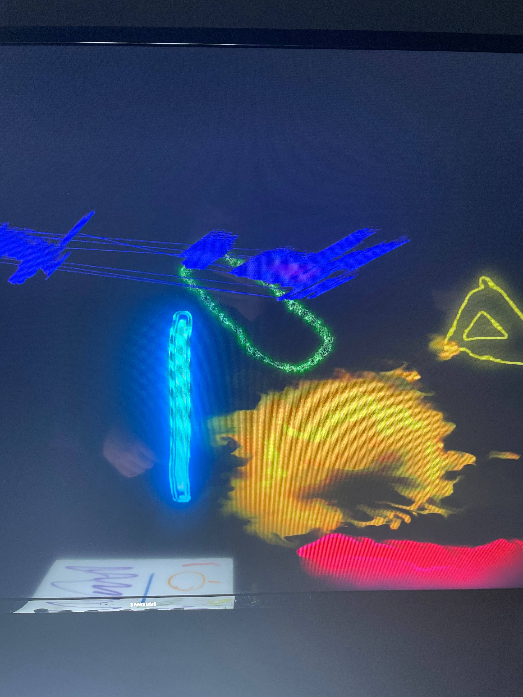

# Prismatica

J'ai participé à l'expérience Prismatica. Elle consiste en une activité ou le participant dessine et le dessin est répliqué avec un certain style sur l'écran placé à coté. Le participant à le droit d'utiliser 7 crayon de couleur différente, et chaque crayon cause un effet différent. 

En plus de cela, la couleur bleu faisait un son proche d'une rivière coulant lentement jusqu'à son lit, la couleur verte donnait un son electrique; la couleur rouge donnait un son ressemblant a une voiture, un peu un son d'ambiance, avec un patterne stressant; L'orange faisait un son d'avion; le mauve fait un son d'alien; Jaune ressemble presque a une chorale.

J'ai remarqué certains effets, par exemple, la couleur jaune a tendance à se faire reconnaitre comme étant la couleur verte. Cela esst dû au fait que les deux couleur sont très proche. Le dispostitif marche grâce à des caméras placés sur les cotés qui identifient les couleurs et leur position, ces infos sont ensuite transféré à un programme qui va alors les affichers sur la télévision.
